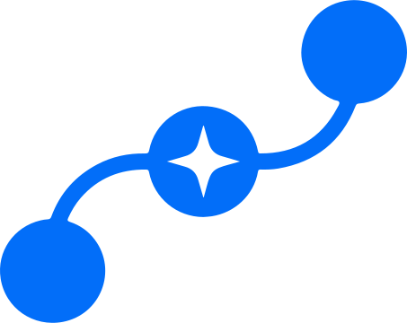
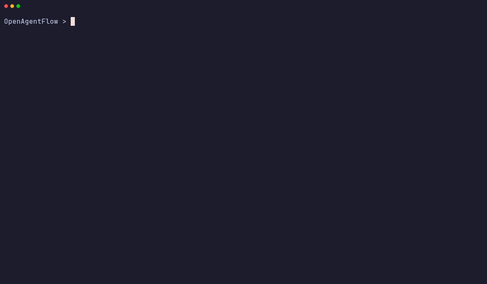

<p align="center">
  
</p>

# OpenAgentFlow

**An Open, Portable Specification for Executable Multi-Agent Workflows**

[](#testing--quality-assurance)
[](#project-structure)
[](#multi-llm--runtime-integration)
[](#multi-llm--runtime-integration)
[](https://marketplace.visualstudio.com/items?itemName=OpenAgentFlow.openagentflow-support)
[](docs/index.md)
[](https://opensource.org/licenses/MIT)

> *What OpenAPI is for REST APIs, OpenAgentFlow (`.oaf`) is for AI agent workflows.*

<p align="center">
  
</p>

### ⚡ The 60-Second Example
Define your multi-agent workflow in clean, human-readable `.oaf` text—completely decoupled from Python/Node boilerplate:

```js
workflow "Quick Summarize" {
    
    state {
        source_text: string @required
        extracted_points: string
        summary: string
    }

    agent Extractor {
        instructions: "Read the `source_text` and extract the most important facts into a concise bulleted list."
        model: "gemini-2.0-flash"
        inputs: [source_text]
        outputs: [extracted_points]
    }

    agent Synthesizer {
        instructions: "Take the extracted points and weave them into a clear, cohesive summary paragraph."
        model: "gpt-4o"
        inputs: [extracted_points]
        outputs: [summary]
    }

    flow {
        start -> Extractor 
        Extractor -> Synthesizer
        Synthesizer -> end
    }
}
```

Install the CLI globally and execute your workflow immediately (or clone our [Starter Repository](https://github.com/OpenAgentFlow/OpenAgentFlow-starter)):
```bash
# Option A: Save the block above to summarize.oaf and run directly
npm install -g openagentflow
oaf run summarize.oaf

# Option B: Clone our official starter repository with pre-built workflows & inputs
git clone https://github.com/OpenAgentFlow/OpenAgentFlow-starter.git my-agents
cd my-agents && npm run setup && npm run triage
```

---

## 🌟 Why OpenAgentFlow?

Modern AI agent frameworks (like LangGraph, AutoGen, and CrewAI) each introduce distinct concepts, Python/Node boilerplate, and proprietary APIs. **OpenAgentFlow** introduces a neutral, human-readable authoring language (`.oaf`) that separates workflow definition from execution runtimes.

### ✨ Key Features
- **Write Once, Run Anywhere**: Define multi-agent topologies, state schemas, and agent instructions once in pure `.oaf` text and compile deterministically to production-ready Python code.
- **Strict Semantic Validation**: Three-phase checking catches dead ends, unreachable agents, and missing fields *before* running expensive LLM calls.
- **Zero-Config Multi-LLM**: Auto-detects and adapts to Gemini, OpenAI, and Anthropic endpoints without changing your `.oaf` code.
- **4-Tier Env Hierarchy & Auth**: Seamlessly resolve API keys across CLI flags, local `.env` files, system variables, and global `~/.oaf/.env` credentials (`oaf auth`).
- **Push-Model State Injection**: Inject JSON payloads (`--input data.json`) directly into workflows for easy backend/API integration.
- **Zero Core Dependencies**: Pure Node.js compiler (`lexer`, `parser`, `validator`, `IR generator`, and `LangGraph adapter`).

---

## 🚀 Quick Start

### Option 1: Using the Starter Repository (Recommended — 60 Seconds)
The fastest way to start building executable multi-agent workflows without manual setup or missing file errors is using our official template repository:

1. **Clone the Starter Project:**
   ```bash
   git clone https://github.com/OpenAgentFlow/OpenAgentFlow-starter.git my-agents
   cd my-agents
   ```

2. **Run Automated Environment Setup:**
   Our cross-platform setup script (`setup.js`) checks your system, creates your Python virtual environment (`venv`), installs LangGraph dependencies, and initializes your `.env` configuration automatically across Windows, macOS, and Linux:
   ```bash
   npm install
   npm run setup
   ```

3. **Configure API Keys (`oaf auth`):**
   Set your keys interactively via CLI (or edit the `.env` file generated in your project root):
   ```bash
   npx openagentflow auth
   ```

4. **Run Your First Workflow Live!**
   Execute pre-built multi-agent topologies immediately:
   ```bash
   # Run Customer Support Triage Workflow with injected JSON state
   npm run triage

   # Or compile directly to a LangGraph Python application
   npm run compile-triage
   ```

---

### Option 2: Standalone Global CLI
If you prefer creating workflows from scratch in your own workspace without cloning a template:

1. **Install Prerequisites & CLI:**
   Ensure **Node.js** (v18+) and **Python** (v3.10+) are installed, then install the CLI globally:
   ```bash
   npm install -g openagentflow
   ```

2. **Set Your API Keys (`oaf auth`):**
   Configure credentials securely in `~/.oaf/.env` (`0o600` permissions):
   ```bash
   oaf auth
   # Or set manually: export GOOGLE_API_KEY="your-key" / $env:GOOGLE_API_KEY="your-key"
   ```

3. **Set Up Python Runtime & Virtual Environment:**
   To execute compiled `.oaf` workflows live via LangGraph against real LLM endpoints:
   ```bash
   # Create and activate Python virtual environment
   python -m venv venv
   source venv/bin/activate  # Windows PowerShell: .\venv\Scripts\Activate.ps1

   # Install LangGraph and multi-provider LangChain drivers
   pip install langgraph langchain-google-genai langchain-openai langchain-anthropic pydantic
   ```

4. **Create & Execute Workflows Live:**
   Create a `.oaf` workflow file (e.g., `my-workflow.oaf`) along with your JSON data (`data.json`) and run:
   ```bash
   oaf run my-workflow.oaf --input data.json
   ```

> 📖 **For the full guide, see [Documentation](docs/index.md)**.

---

## 📖 Documentation

The complete documentation is available in the `docs/` directory, including:
* **[Language Reference](docs/language/oaf-language.md):** Complete `.oaf` syntax.
* **[Formal Specs](spec/SPEC.md):** EBNF grammar, semantic rules, and IR schema.
* **[API & CLI Ref](docs/cli/cli-reference.md):** Programmatic API and command-line flags.

---

## 📝 The `.oaf` Language at a Glance

OpenAgentFlow provides a clean, declarative syntax for describing stateful multi-agent workflows:

```oaf
workflow "Quick Summarize" {

    config {
        max_iterations: 5
        timeout_seconds: 60
    }

    state {
        request: string
        source_text: string
        key_points: list[string]
        summary: string
    }

    agent Analyst {
        instructions: """
        Analyze the request and source text.
        Identify the most important facts.
        """
        model: "gpt-4"
        temperature: 0.2
        inputs: [request, source_text]
        outputs: [key_points]
    }

    agent Writer {
        instructions: """
        Write a clear, concise summary from the key points.
        """
        model: "gpt-4"
        temperature: 0.7
        inputs: [key_points]
        outputs: [summary]
    }

    flow {
        start -> Analyst
        Analyst -> Writer
        Writer -> end
    }
}
```

---

## ⚙️ Compilation & Execution Pipeline

The OpenAgentFlow compiler transforms raw `.oaf` source code into validated Intermediate Representation (IR) JSON, which runtime adapters then transform into executable source code:

```
┌─────────────┐     ┌───────────┐     ┌────────────┐     ┌───────────────────┐
│ Source Code │ ──▶ │   Lexer   │ ──▶ │   Parser   │ ──▶ │    AST (JSON)     │
│  (.oaf file)│     │ (lexer.js)│     │(parser.js) │     │    (ast.js)       │
└─────────────┘     └───────────┘     └────────────┘     └─────────┬─────────┘
                                                                   │
┌─────────────┐     ┌───────────┐     ┌────────────┐     ┌─────────▼─────────┘
│  Execution  │ ◀── │ LangGraph │ ◀── │  Compiler  │ ◀── │ Semantic Validator│
│ (Live Subproc)    │  Adapter  │     │ (IR Gen)   │     │  (validator.js)   │
└─────────────┘     └───────────┘     └────────────┘     └───────────────────┘
```

---

## 🧠 Multi-LLM & Runtime Integration

When compiling to LangGraph, the runtime automatically manages providers. You can specify `model: "gpt-4o"` or `model: "gemini-2.0-flash"` in your `.oaf` file, and the compiled Python script will auto-detect your API keys (via `.env`, system vars, or `~/.oaf/.env`) and route the request to the correct provider.

---

## 🗺️ Roadmap & Project Status

| Phase | Deliverables | Status |
| :--- | :--- | :--- |
| **Phase 1** — Specification | Language spec (`SPEC.md`), EBNF grammar, examples, IR definition | ✅ Complete |
| **Phase 2** — Compiler MVP | Zero-dependency Lexer, Parser, 3-Phase Validator, IR Generator, CLI | ✅ Complete |
| **Phase 3** — Runtime Integration | LangGraph Python Adapter, Dual-LLM (`get_llm()`), Live `run` CLI, E2E Demo | ✅ Complete |
| **Phase 4** — State Initialization (`--input`) | File-based state injection (`--input data.json`), runtime override (`OAF_INPUT_FILE`) | ✅ Complete |
| **Phase 4.5** — Multi-Provider, Auth & Tooling | Anthropic (`claude-*`) & Google (`gemma-*`) inference, `oaf auth`, VS Code syntax extension (`.oaf`) | ✅ Complete |
| **Phase 5** — Additional Adapters | AutoGen Adapter, CrewAI Adapter, Formal `Adapter` base contract | 🔲 Planned |
| **Phase 6** — Developer CLI Tooling | `oaf fmt` (auto-formatter), `oaf init` (project scaffolding) | 🔲 Planned |

---

## 🤝 Contributing

We welcome contributions from developers, researchers, and engineers! Whether you want to pick up a [`good first issue`](https://github.com/OpenAgentFlow/openagentflow/issues?q=is%3Aissue+is%3Aopen+label%3A%22good+first+issue%22), help build our planned Phase 5 target adapters (**Microsoft AutoGen** or **CrewAI**), or propose language enhancements, please check out our detailed [Contributing Guide](CONTRIBUTING.md) to get started.

---

## 📄 License

This project is open-source and licensed under the [MIT License](LICENSE).
