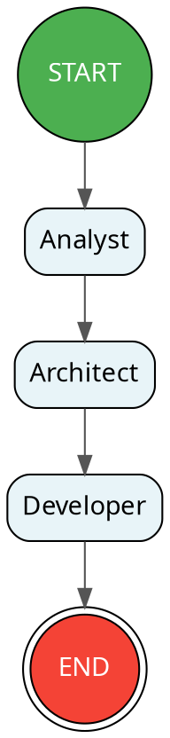

# CLI Reference

Complete reference for the OpenAgentFlow command-line interface.

---

## Usage

```bash
node cli/index.js <command> [options] <file.oaf>
```

Or if installed globally via npm:

```bash
oaf <command> [options] <file.oaf>
```

---

## Commands

### `parse`

Tokenize and parse a `.oaf` file, outputting the AST as JSON.

```bash
node cli/index.js parse <file.oaf>
```

**Example:**
```bash
node cli/index.js parse examples/hello.oaf
```

**Output:** JSON representation of the Abstract Syntax Tree.

**Use when:** You want to inspect the parsed structure of a workflow or debug syntax issues.

---

### `validate`

Parse and run semantic validation (3-phase) on a `.oaf` file.

```bash
node cli/index.js validate <file.oaf>
```

**Example:**
```bash
node cli/index.js validate examples/summarize.oaf
```

**Success output:**
```
✓ summarize.oaf is valid.
```

**With warnings:**
```
[WARNING] summarize.oaf:5:5 — State variable "unused" is never referenced

✓ summarize.oaf is valid.
  1 warning(s)
```

**With errors:**
```
[ERROR] summarize.oaf:12:5 — Duplicate agent identifier: "Analyst"

✗ summarize.oaf has 1 error(s).
```

**Use when:** You want to check a workflow for errors without compiling or running it.

---

### `compile`

Full compilation pipeline: parse → validate → generate output.

```bash
node cli/index.js compile <file.oaf> [--target <target>] [-o <output>] [--input <json>]
```

**Options:**

| Flag | Description | Default |
|---|---|---|
| `--target`, `-t` | Compilation target: `ir` or `langgraph` | `ir` |
| `-o` | Output file path (writes to file instead of stdout) | stdout |
| `--input`, `-i` | Path to JSON file with initial state values | — |

**Examples:**

```bash
# Compile to IR JSON (default)
node cli/index.js compile examples/hello.oaf

# Compile to LangGraph Python
node cli/index.js compile examples/hello.oaf --target langgraph

# Save compiled output to file
node cli/index.js compile examples/hello.oaf -t langgraph -o hello.py

# Embed initial state values
node cli/index.js compile examples/summarize.oaf -t langgraph -i data.json -o summarize.py
```

**Output:**
- `ir` target: JSON document (the Intermediate Representation)
- `langgraph` target: Self-contained Python script

---

### `run`

Compile to a runtime target and immediately execute via Python subprocess.

```bash
node cli/index.js run <file.oaf> [--target <target>] [--input <json>]
```

**Options:**

| Flag | Description | Default |
|---|---|---|
| `--target`, `-t` | Runtime target | `langgraph` |
| `--input`, `-i` | Path to JSON file with initial state values | — |

**Examples:**

```bash
# Run with default settings (auto-detects provider)
node cli/index.js run examples/hello.oaf

# Run with initial state data
node cli/index.js run examples/summarize.oaf --input examples/summarize-input.json

# Run the e2e demo
node cli/index.js run examples/e2e-demo/feedback-analysis.oaf
```

**Pre-flight checks (automatic):**
1. Python runtime exists and is accessible
2. At least one API key is set (`GOOGLE_API_KEY` or `OPENAI_API_KEY`)
3. All agents have a model specified (or `OAF_DEFAULT_MODEL` is set)

**Execution flow:**
1. Compiles `.oaf` to LangGraph Python code
2. Writes generated code to a temp file
3. Spawns Python subprocess
4. Streams stdout/stderr to terminal
5. Cleans up temp file

> **Note:** The `run` command cannot use `--target ir` (IR is not executable). It defaults to `langgraph`.

---

### `graph`

Generate a Graphviz DOT diagram of the workflow topology.

```bash
node cli/index.js graph <file.oaf>
```

**Example:**
```bash
node cli/index.js graph examples/software-dev.oaf
```

**Output:**


**Use when:** You want to visualize the flow topology. Paste the output into [Graphviz Online](https://dreampuf.github.io/GraphvizOnline/) or any DOT renderer.

---

## Global Options

| Flag | Description |
|---|---|
| `--help`, `-h` | Show usage information |
| `--version`, `-v` | Show version (`0.1.0`) |

---

## Flag Syntax

Flags accept both `--flag value` and `--flag=value` forms:

```bash
# Both are equivalent
node cli/index.js compile file.oaf --target langgraph
node cli/index.js compile file.oaf --target=langgraph

# Short forms
node cli/index.js compile file.oaf -t langgraph
node cli/index.js run file.oaf -i data.json
```

---

## Environment Variables

| Variable | Purpose | Used By |
|---|---|---|
| `GOOGLE_API_KEY` | Google Gemini API key | `run` command, generated Python |
| `OPENAI_API_KEY` | OpenAI API key | `run` command, generated Python |
| `OAF_DEFAULT_MODEL` | Default model when agent has no `model` property | `run` command, generated Python |
| `OAF_INPUT_FILE` | Runtime input JSON file path (alternative to `--input`) | Generated Python scripts |
| `VIRTUAL_ENV` | Python virtual environment path (auto-detected) | `run` command |

### Provider Priority

When executing workflows, the provider is selected in this order:

1. Agent's explicit `provider` property (in `.oaf`)
2. `GOOGLE_API_KEY` present → Gemini
3. `OPENAI_API_KEY` present → OpenAI
4. Error: no provider available

---

## Python Auto-Detection

The `run` command searches for Python in this order:

1. `$VIRTUAL_ENV/Scripts/python.exe` (Windows) or `$VIRTUAL_ENV/bin/python` (POSIX)
2. `.venv/Scripts/python.exe` (Windows) or `.venv/bin/python` (POSIX) in the current directory
3. System `python`

---

## Exit Codes

| Code | Meaning |
|---|---|
| `0` | Success |
| `1` | Error (compilation failure, missing file, execution failure) |

---

## Error Messages

### CLI Errors

| Error | Cause | Solution |
|---|---|---|
| `Missing file argument` | No `.oaf` file provided | Add file path: `oaf run file.oaf` |
| `Unknown command "X"` | Invalid command name | Use `parse`, `validate`, `compile`, `run`, or `graph` |
| `Unknown target "X"` | Invalid `--target` value | Use `ir` or `langgraph` |
| `Cannot read file: X` | File not found or inaccessible | Check the file path |
| `Cannot execute IR directly` | `run` with `--target ir` | Use `--target langgraph` |

### Pre-Flight Errors (run command)

| Error | Cause | Solution |
|---|---|---|
| `Python runtime not found` | Python not installed | Install Python 3.10+ |
| `No LLM API key configured` | Neither API key is set | Set `GOOGLE_API_KEY` or `OPENAI_API_KEY` |
| `No model specified for agent "X"` | Agent has no model and no default | Add `model:` to agent or set `OAF_DEFAULT_MODEL` |

### Runtime Hints

The CLI provides hints for common Python-side errors:

| Python Error | Hint |
|---|---|
| `ModuleNotFoundError` | `pip install langgraph langchain-openai` |
| `OPENAI_API_KEY` error | `export OPENAI_API_KEY='your-key'` |

---

## Complete Example Session

```bash
# 1. Check the CLI is working
node cli/index.js --version
# 0.1.0

# 2. Parse a workflow
node cli/index.js parse examples/hello.oaf
# Outputs AST JSON

# 3. Validate it
node cli/index.js validate examples/hello.oaf
# ✓ hello.oaf is valid.

# 4. Compile to IR
node cli/index.js compile examples/hello.oaf
# Outputs IR JSON

# 5. Compile to Python
node cli/index.js compile examples/hello.oaf -t langgraph -o hello.py
# ✓ Compiled hello.oaf → hello.py (target: langgraph)

# 6. Visualize the graph
node cli/index.js graph examples/hello.oaf
# Outputs DOT format

# 7. Run live
node cli/index.js run examples/hello.oaf
# ✓ Compiled hello.oaf (target: langgraph)
# ▶ Executing workflow via Python subprocess...
# ... LLM output ...
# ✓ Workflow execution completed successfully.
```

---

## Next Steps

- **[Configuration](../guides/configuration.md)** — Environment setup and LLM providers
- **[Examples](../examples/examples.md)** — Walk through all example workflows
- **[Troubleshooting](../guides/troubleshooting.md)** — Debug common issues
