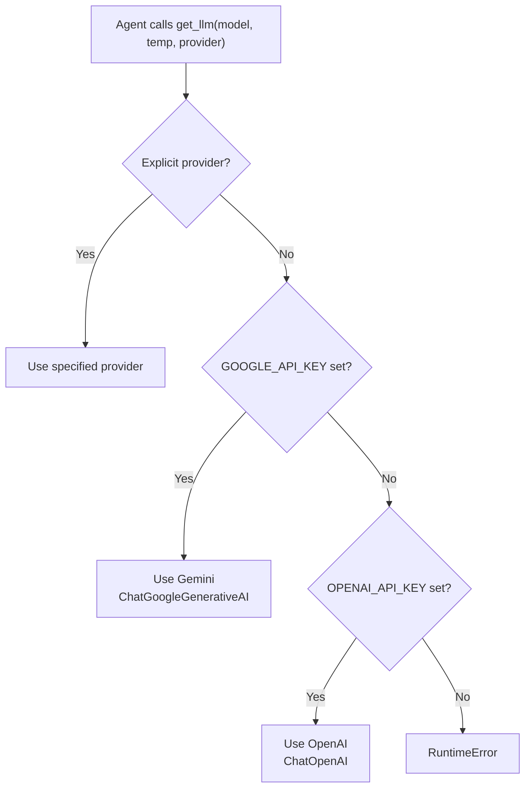

# Adapters Component

This page documents the runtime adapter module (`adapters/`), which transforms the Intermediate Representation into executable code for specific runtime frameworks.

---

## Overview

Currently, OAF ships with one adapter:

| Adapter | Directory | Target Framework |
|---|---|---|
| **LangGraph** | `adapters/langgraph/` | LangGraph (Python) |

Future planned adapters include AutoGen and CrewAI.

| File | Class/Export | Purpose |
|---|---|---|
| `adapters/langgraph/index.js` | `LangGraphAdapter` | IR → Python code generation |
| `adapters/langgraph/templates.js` | 7 template functions | Python code template generators |

---

## LangGraph Adapter

The `LangGraphAdapter` class transforms OAF IR into a self-contained, executable LangGraph Python script.

### API

```javascript
import { LangGraphAdapter } from './adapters/langgraph/index.js';

const adapter = new LangGraphAdapter(ir, options);
const pythonCode = adapter.generate(); // Returns string
```

**Constructor:**

| Parameter | Type | Default | Description |
|---|---|---|---|
| `ir` | `object` | — | The OAF IR document |
| `options` | `object` | `{}` | Adapter options |
| `options.input` | `object` | `undefined` | Initial state values from `--input` JSON file |

### Methods

#### `generate()`

Generates the complete Python source code.

- **Returns:** `string` — a self-contained Python script
- **Throws:** `Error` if the IR is incompatible (see `checkCompatibility()`)

```javascript
const adapter = new LangGraphAdapter(ir, { input: { feedback: "Great product!" } });
const code = adapter.generate();
// code is a complete Python script ready to execute
```

#### `checkCompatibility()`

Validates that the IR can be compiled to LangGraph.

- **Returns:** `{ supported: boolean, issues: string[] }`

```javascript
const compat = adapter.checkCompatibility();
if (!compat.supported) {
    console.error('Issues:', compat.issues.join('; '));
}
```

Compatibility checks:
- IR must have an entrypoint
- IR must have at least one terminal node
- IR must have at least one agent

### Input Validation

When `options.input` is provided, the adapter validates it against the workflow state:

| Validation | Error Message |
|---|---|
| Unknown key | `Input JSON contains variable "X" which is not defined in workflow state` |
| Type mismatch | `Type mismatch for state variable "X": expected string, found number` |
| Missing required | `Missing required initial state variable: "X"` |

Type compatibility rules:

| IR Type | Accepted JS Types |
|---|---|
| `string` | `typeof val === 'string'` |
| `int` | `typeof val === 'number' && Number.isInteger(val)` |
| `float` | `typeof val === 'number'` |
| `bool` | `typeof val === 'boolean'` |
| `list<*>` | `Array.isArray(val)` |
| `map<*,*>` | `typeof val === 'object' && !Array.isArray(val)` |

---

## Generated Python Structure

The adapter generates a Python script with these sections:

```python
"""
OpenAgentFlow — Generated LangGraph Workflow
Workflow: Customer Feedback Analysis
Generated by: OpenAgentFlow Compiler v0.1.0
"""

# 1. Imports
import os, sys, json
from typing import TypedDict, Optional, List
from langgraph.graph import StateGraph, END
from langchain_google_genai import ChatGoogleGenerativeAI
from langchain_openai import ChatOpenAI

# 2. State Schema
class WorkflowState(TypedDict, total=False):
    feedback: Optional[str]    # @required
    sentiment: Optional[str]
    category: Optional[str]
    key_issues: Optional[List[str]]
    response_draft: Optional[str]

# 3. LLM Helper
def get_llm(model=None, temperature=0.7, provider=None):
    """Auto-detects provider from API keys or uses explicit provider."""
    ...

# 4. Agent Node Functions
def sentiment_analyzer_node(state: WorkflowState) -> WorkflowState:
    """Agent: SentimentAnalyzer"""
    ...

def categorizer_node(state: WorkflowState) -> WorkflowState:
    """Agent: Categorizer"""
    ...

# 5. Graph Construction
def build_graph() -> StateGraph:
    graph = StateGraph(WorkflowState)
    graph.add_node("SentimentAnalyzer", sentiment_analyzer_node)
    graph.add_node("Categorizer", categorizer_node)
    graph.set_entry_point("SentimentAnalyzer")
    graph.add_edge("SentimentAnalyzer", "Categorizer")
    graph.add_edge("Categorizer", END)
    return graph.compile()

# 6. Execution
if __name__ == "__main__":
    app = build_graph()
    initial_state = { ... }
    result = app.invoke(initial_state)
```

---

## Type Mapping

The adapter maps OAF/IR types to Python typing annotations:

| OAF Type | IR Descriptor | Python Type |
|---|---|---|
| `string` | `"string"` | `str` |
| `int` | `"int"` | `int` |
| `float` | `"float"` | `float` |
| `bool` | `"bool"` | `bool` |
| `list[string]` | `"list<string>"` | `List[str]` |
| `list[list[int]]` | `"list<list<int>>"` | `List[List[int]]` |
| `map[string, int]` | `"map<string,int>"` | `Dict[str, int]` |
| Unknown | — | `Any` |

All state fields are wrapped in `Optional[T]` in the generated TypedDict. Fields with `@reducer` are wrapped in `Annotated[Optional[T], operator.add]`.

---

## Agent Node Generation

Each agent becomes a Python function that:

1. **Gets an LLM instance** via `get_llm(model, temperature, provider)`
2. **Builds a prompt** from the agent's inputs
3. **Calls the LLM** via `llm.invoke(messages)`
4. **Returns state updates** based on the outputs

### Single Output Agent

When an agent has exactly one output, the LLM response is assigned directly:

```python
def analyst_node(state):
    # ... call LLM ...
    return {"key_points": result}
```

### Multi-Output Agent

When an agent has multiple outputs, the adapter generates JSON parsing logic:

```python
def categorizer_node(state):
    # ... call LLM ...
    try:
        parsed = json.loads(result)
        updates = {}
        if "category" in parsed:
            updates["category"] = parsed["category"]
        if "key_issues" in parsed:
            updates["key_issues"] = parsed["key_issues"]
        return updates
    except (json.JSONDecodeError, TypeError):
        # Fallback: assign raw result to first output
        return {"category": result}
```

### No Output Agent

When an agent has no outputs, it returns an empty dict:

```python
def logger_node(state):
    # ... call LLM ...
    return {}
```

---

## LLM Provider System

The generated `get_llm()` function handles provider selection:



### Model Resolution

1. If the agent has a `model` property → use that model directly
2. If no model → check `OAF_DEFAULT_MODEL` environment variable
3. If neither → raise a `RuntimeError`

### Import Safety

The generated imports use try/except to gracefully handle missing packages:

```python
_LLM_PROVIDER = None
try:
    from langchain_google_genai import ChatGoogleGenerativeAI
    if os.environ.get("GOOGLE_API_KEY"):
        _LLM_PROVIDER = "gemini"
except ImportError:
    pass

if _LLM_PROVIDER is None:
    try:
        from langchain_openai import ChatOpenAI
        if os.environ.get("OPENAI_API_KEY"):
            _LLM_PROVIDER = "openai"
    except ImportError:
        pass
```

---

## State Initialization

The generated `__main__` block supports state injection from multiple sources:

### 1. Compile-Time Embedding

When `--input data.json` is passed to `oaf compile`, the adapter embeds the values directly:

```python
initial_state = {
    "feedback": "Great product but needs improvements",
    "sentiment": "",
    "category": "",
}
```

### 2. Runtime Override

The generated script also reads `--input` or `OAF_INPUT_FILE` at runtime:

```python
input_file = os.environ.get("OAF_INPUT_FILE")
for idx in range(len(args)):
    if args[idx] in ("--input", "-i") and idx + 1 < len(args):
        input_file = args[idx + 1]
        break

if input_file:
    with open(input_file, "r", encoding="utf-8") as f:
        runtime_input = json.load(f)
        if isinstance(runtime_input, dict):
            initial_state.update(runtime_input)
```

### 3. Required Fields Validation

If state variables have `@required`, the generated script validates them:

```python
missing_required = [
    f for f in ["feedback"]
    if initial_state.get(f) is None or 
       (isinstance(initial_state.get(f), str) and initial_state.get(f) == "")
]
if missing_required:
    print(f"Error: Missing required state variables: {', '.join(missing_required)}")
    sys.exit(1)
```

---

## Console Encoding Safety

The generated script includes encoding safety for Windows terminals:

```python
if hasattr(sys.stdout, 'reconfigure'):
    sys.stdout.reconfigure(encoding='utf-8')
```

This prevents crashes on Windows terminals with non-UTF-8 codepages (e.g., `cp1256`, `cp1252`).

---

## Template Functions

The `templates.js` module contains seven template generators. Each receives a structured data object and returns a Python code string:

| Function | Purpose |
|---|---|
| `generateHeaderTemplate(params)` | File header comment block |
| `generateImportsTemplate(params)` | Python imports (typing, langgraph, providers) |
| `generateStateClassTemplate(params)` | `WorkflowState` TypedDict class |
| `generateLlmHelperTemplate(params)` | `get_llm()` function |
| `generateAgentNodeTemplate(params)` | Individual agent node function |
| `generateGraphBuilderTemplate(params)` | `build_graph()` function |
| `generateMainTemplate(params)` | `__main__` execution block |

The adapter's `_buildGenerationModel()` method prepares the data objects, keeping compiler logic (IR inspection, type conversion, validation) separate from template rendering.

---

## Complete Example

```javascript
import { Compiler } from './compiler/index.js';
import { LangGraphAdapter } from './adapters/langgraph/index.js';
import { readFileSync, writeFileSync } from 'fs';

// 1. Compile the .oaf file
const source = readFileSync('examples/summarize.oaf', 'utf-8');
const compiler = new Compiler(source, 'summarize.oaf');
const result = compiler.compile();

if (result.status !== 'success') {
    console.error('Compilation failed');
    process.exit(1);
}

// 2. Load input data
const inputData = JSON.parse(readFileSync('examples/summarize-input.json', 'utf-8'));

// 3. Generate Python code
const adapter = new LangGraphAdapter(result.ir, { input: inputData });
const pythonCode = adapter.generate();

// 4. Save to file
writeFileSync('summarize.py', pythonCode, 'utf-8');
console.log('Generated summarize.py');
```

---

## Next Steps

- **[CLI Reference](../cli/cli-reference.md)** — Use the CLI to compile and run workflows
- **[IR Schema](../api/ir-schema.md)** — Understand the IR format consumed by adapters
- **[Configuration](../guides/configuration.md)** — LLM providers and environment setup
