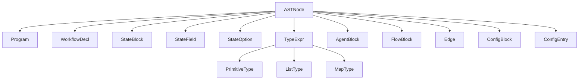

# Parser Component

This page documents the parser module (`parser/`), which transforms raw `.oaf` source text into a structured Abstract Syntax Tree (AST).

---

## Overview

The parser module contains three files:

| File | Class/Export | Purpose |
|---|---|---|
| `lexer.js` | `Lexer`, `Token`, `TokenType`, `LexerError` | Tokenizes source text |
| `ast.js` | 14 AST node classes | Defines the tree structure |
| `parser.js` | `Parser`, `ParseError` | Recursive-descent parser |
| `index.js` | — | Public API re-exports |

Pipeline position: **Source Text → [Lexer] → Token Stream → [Parser] → AST**

---

## Lexer

The `Lexer` class performs lexical analysis — reading raw `.oaf` source text and producing a stream of `Token` objects.

### Token Types

```javascript
import { TokenType } from './parser/index.js';
```

| Category | Token Types |
|---|---|
| **Keywords** | `WORKFLOW`, `AGENT`, `STATE`, `FLOW`, `CONFIG`, `START`, `END` |
| **Type Keywords** | `STRING_TYPE`, `INT_TYPE`, `FLOAT_TYPE`, `BOOL_TYPE`, `LIST_TYPE`, `MAP_TYPE` |
| **Boolean Literals** | `TRUE`, `FALSE` |
| **Literals** | `STRING`, `TRIPLE_STRING`, `INTEGER`, `FLOAT`, `IDENTIFIER` |
| **Punctuation** | `LBRACE` `{`, `RBRACE` `}`, `LBRACKET` `[`, `RBRACKET` `]`, `LPAREN` `(`, `RPAREN` `)`, `COLON` `:`, `COMMA` `,`, `ARROW` `->`, `AT` `@` |
| **Special** | `EOF` |

### Token Class

Each token carries its type, raw value, and source location:

```javascript
class Token {
    constructor(type, value, line, column)
    // type: string — one of TokenType values
    // value: string — raw lexeme
    // line: number — 1-based line number
    // column: number — 1-based column number
    
    toString() // Returns "Token(TYPE, "value", line:col)"
}
```

### Lexer API

```javascript
import { Lexer } from './parser/index.js';

const lexer = new Lexer(source, 'example.oaf');
const tokens = lexer.tokenize(); // Returns Token[]
```

**Constructor:**

| Parameter | Type | Default | Description |
|---|---|---|---|
| `source` | `string` | — | The `.oaf` source text |
| `filename` | `string` | `'<input>'` | Filename for diagnostic messages |

**Method: `tokenize()`**
- Returns: `Token[]` — array of tokens, always ending with `EOF`
- Throws: `LexerError` on invalid input

### Lexer Behavior

| Feature | Behavior |
|---|---|
| **Line endings** | CRLF normalized to LF |
| **Comments** | `// ...` stripped during tokenization |
| **Whitespace** | Ignored between tokens |
| **String escapes** | `\"`, `\\`, `\n`, `\t` |
| **Triple strings** | Leading whitespace dedented (common-indent algorithm) |
| **Numbers** | Negative numbers (`-42`), floats (`0.7`), negative floats (`-0.5`) |
| **Identifiers** | `[A-Za-z_][A-Za-z0-9_-]*` (hyphens allowed except before `>`) |

### LexerError

Thrown when the lexer encounters invalid input:

```javascript
class LexerError extends Error {
    constructor(message, line, column)
    // name: 'LexerError'
    // message: '[ERROR] line:col — message'
    // line: number
    // column: number
}
```

Common errors:
- `Unexpected character: 'X'`
- `Unterminated string literal`
- `Unterminated triple-quoted string`

### Example

```javascript
import { Lexer, TokenType } from './parser/index.js';

const source = `workflow "Hello" {
    agent Greeter {
        instructions: "Say hi"
    }
    flow {
        start -> Greeter
        Greeter -> end
    }
}`;

const lexer = new Lexer(source);
const tokens = lexer.tokenize();

for (const token of tokens) {
    console.log(token.toString());
}
// Token(WORKFLOW, "workflow", 1:1)
// Token(STRING, "Hello", 1:10)
// Token(LBRACE, "{", 1:18)
// Token(AGENT, "agent", 2:5)
// ... and so on
```

---

## AST Nodes

The `ast.js` file defines 14 node classes that form the abstract syntax tree.

### Node Hierarchy



### Base Node

All AST nodes extend `ASTNode`:

```javascript
class ASTNode {
    constructor(type, line, column)
    // type: string — node type identifier
    // line: number — source line
    // column: number — source column
}
```

### Program

Root node of the AST:

```javascript
class Program extends ASTNode {
    workflow  // WorkflowDecl
}
```

### WorkflowDecl

```javascript
class WorkflowDecl extends ASTNode {
    name     // string — workflow name
    state    // StateBlock | null
    agents   // AgentBlock[]
    flow     // FlowBlock
    config   // ConfigBlock | null
}
```

### StateBlock & StateField

```javascript
class StateBlock extends ASTNode {
    fields   // StateField[]
}

class StateField extends ASTNode {
    name      // string — variable name
    typeExpr  // TypeExpr — type expression
    options   // StateOption[] — decorators
}

class StateOption extends ASTNode {
    name  // string — option name (without @)
    args  // Array<*> — option arguments
}
```

### Type Expressions

```javascript
class TypeExpr extends ASTNode {
    kind  // 'primitive' | 'list' | 'map'
}

class PrimitiveType extends TypeExpr {
    name  // 'string' | 'int' | 'float' | 'bool'
}

class ListType extends TypeExpr {
    elementType  // TypeExpr
}

class MapType extends TypeExpr {
    keyType    // TypeExpr
    valueType  // TypeExpr
}
```

### AgentBlock

```javascript
class AgentBlock extends ASTNode {
    id            // string — agent identifier
    instructions  // string — required prompt text
    model         // string | null
    provider      // string | null
    temperature   // number | null
    tools         // string[]
    inputs        // string[]
    outputs       // string[]
}
```

### FlowBlock & Edge

```javascript
class FlowBlock extends ASTNode {
    edges  // Edge[]
}

class Edge extends ASTNode {
    source  // string — 'start', agent ID
    target  // string — 'end', agent ID
}
```

### ConfigBlock & ConfigEntry

```javascript
class ConfigBlock extends ASTNode {
    entries  // ConfigEntry[]
}

class ConfigEntry extends ASTNode {
    key    // string
    value  // string | number | boolean
}
```

---

## Parser

The `Parser` class is a recursive-descent parser that consumes a token stream and produces a `Program` AST node.

### Parser API

```javascript
import { Parser } from './parser/index.js';

const parser = new Parser(tokens);
const ast = parser.parse(); // Returns Program
```

**Constructor:**

| Parameter | Type | Description |
|---|---|---|
| `tokens` | `Token[]` | Token array from `Lexer.tokenize()` |

**Method: `parse()`**
- Returns: `Program` — the root AST node
- Throws: `ParseError` on syntax errors

### ParseError

```javascript
class ParseError extends Error {
    constructor(message, token)
    // name: 'ParseError'
    // message: '[ERROR] line:col — message'
    // token: Token — the offending token
    // line: number
    // column: number
}
```

Common parse errors:
- `Expected TYPE but found TYPE "value"`
- `Duplicate property "X" in agent "Y"`
- `Agent "X" is missing required "instructions" property`
- `Agent "X" instructions cannot be empty string`
- `Unknown agent property: "X"`
- `Multiple state blocks declared`
- `Multiple flow blocks declared`
- `Multiple config blocks declared`
- `Duplicate configuration key "X"`

### Parser Internals

The parser uses these helper methods (internal, but useful to understand error messages):

| Method | Purpose |
|---|---|
| `expect(type, msg)` | Consume a token of the expected type, or throw `ParseError` |
| `check(type)` | Test if current token matches (no consume) |
| `match(type)` | Consume if matches, return `null` otherwise |

---

## Public API

The `parser/index.js` file re-exports everything a consumer needs:

```javascript
// parser/index.js
export { Lexer, Token, TokenType, LexerError } from './lexer.js';
export { Parser, ParseError } from './parser.js';
export * from './ast.js';
```

### Complete Example

```javascript
import { Lexer, Parser } from './parser/index.js';

const source = `
workflow "Test" {
    state {
        message: string
    }
    agent Bot {
        instructions: "Reply to the message."
        model: "gemini-2.0-flash"
        inputs: [message]
        outputs: [message]
    }
    flow {
        start -> Bot
        Bot -> end
    }
}
`;

// Step 1: Tokenize
const lexer = new Lexer(source, 'test.oaf');
const tokens = lexer.tokenize();

// Step 2: Parse
const parser = new Parser(tokens);
const ast = parser.parse();

// Step 3: Inspect the AST
console.log(ast.workflow.name);          // "Test"
console.log(ast.workflow.agents.length); // 1
console.log(ast.workflow.agents[0].id);  // "Bot"
console.log(ast.workflow.flow.edges.length); // 2
```

---

## Next Steps

- **[Compiler Component](compiler.md)** — Validation, IR generation, and the pipeline orchestrator
- **[API Reference](../api/api-reference.md)** — Complete class/method reference
