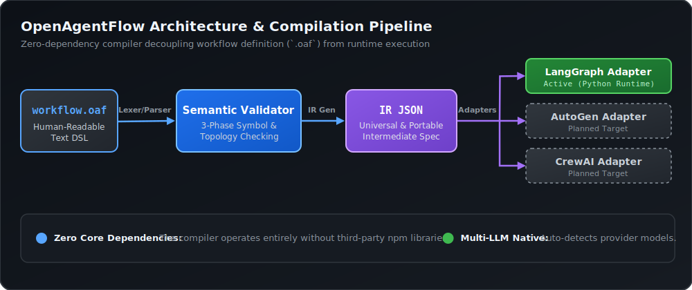
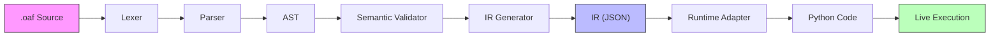
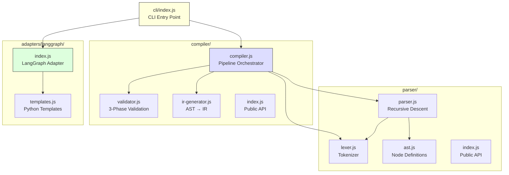
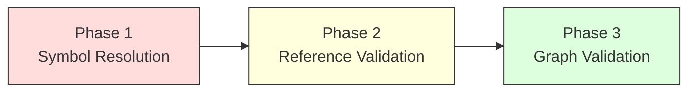
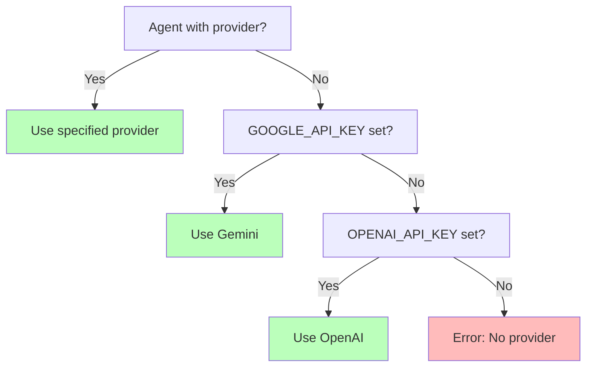

# Architecture

<p align="center">
  
</p>

This page explains the design philosophy, compilation pipeline, and module architecture of OpenAgentFlow.

---

## What Is OpenAgentFlow?

OpenAgentFlow (OpenAgentFlow) is a **domain-specific language and compiler** for defining portable AI agent workflows. Think of it as what OpenAPI is for REST APIs — a neutral, human-readable specification format that separates workflow *definition* from *execution*.

### The Problem

Modern AI agent frameworks (LangGraph, AutoGen, CrewAI) each have:
- Proprietary Python/Node APIs
- Different agent abstractions
- Framework-specific boilerplate
- Vendor lock-in

### The Solution

OpenAgentFlow provides:
- A **clean `.oaf` text format** for defining multi-agent workflows
- A **zero-dependency compiler** that validates and transforms workflows
- **Runtime adapters** that generate framework-specific code (currently LangGraph)
- **Strict validation** that catches errors before expensive LLM calls

---

## Design Principles

| Principle | Description |
|---|---|
| **Zero Dependencies** | The entire compiler runs on pure Node.js — no npm packages required |
| **Write Once, Run Anywhere** | `.oaf` files are runtime-independent; adapters generate target-specific code |
| **Fail Early** | 3-phase semantic validation catches dead ends, missing references, and type errors at compile time |
| **Deterministic** | The same `.oaf` input always produces the same IR output |
| **Human-Readable** | `.oaf` syntax is designed to be understood at a glance |

---

## Compilation Pipeline

The OpenAgentFlow compiler transforms source code through a series of well-defined stages:



### Stage Details

| Stage | Module | Input | Output | Description |
|---|---|---|---|---|
| **1. Lexical Analysis** | `parser/lexer.js` | Source text | Token stream | Tokenizes `.oaf` source into keywords, strings, identifiers, punctuation |
| **2. Parsing** | `parser/parser.js` | Tokens | AST | Recursive-descent parser builds an Abstract Syntax Tree |
| **3. Semantic Validation** | `compiler/validator.js` | AST | Validated AST + Diagnostics | 3-phase validation: symbol resolution, reference checking, graph topology |
| **4. IR Generation** | `compiler/ir-generator.js` | Validated AST | IR JSON | Transforms AST into runtime-independent Intermediate Representation |
| **5. Code Generation** | `adapters/langgraph/` | IR | Python source | Adapter generates executable LangGraph Python code |
| **6. Execution** | `cli/index.js` | Python code | LLM output | Spawns Python subprocess to execute the workflow |

### Pipeline Orchestrator

The `Compiler` class (`compiler/compiler.js`) orchestrates stages 1–4. Each stage can also be invoked independently:

```javascript
import { Compiler } from './compiler/index.js';

const compiler = new Compiler(source, 'example.oaf');

// Full pipeline
const result = compiler.compile();

// Or individual stages
const tokens = compiler.lex();
const ast = compiler.parse(tokens);
const validation = compiler.validate(ast);
const ir = compiler.generateIR(ast);
```

---

## Module Architecture



### Module Responsibilities

| Module | Responsibility |
|---|---|
| **`parser/`** | Lexical analysis, AST node definitions, syntax parsing |
| **`compiler/`** | Semantic validation, IR generation, pipeline orchestration |
| **`adapters/`** | Runtime-specific code generation (currently LangGraph only) |
| **`cli/`** | Command-line interface, argument parsing, subprocess management |
| **`spec/`** | Formal language specifications (not executable code) |
| **`examples/`** | Sample `.oaf` workflows |
| **`tests/`** | 131-test suite across 9 test files |

---

## Three-Phase Semantic Validation

The validator is a key architectural component. It performs three ordered phases on the AST:



| Phase | What It Checks |
|---|---|
| **Phase 1: Symbol Resolution** | Duplicate agent names, duplicate state variables, reserved keywords, block cardinality |
| **Phase 2: Reference Validation** | Flow edge references, input/output variable references, temperature range, provider values, config entries |
| **Phase 3: Graph Validation** | Start/end edges, reachability from start, path to end, duplicate edges, self-loops, cycle detection |

Each phase only runs if the previous phase found no errors. This prevents cascading error messages from confusing users.

---

## Dual-LLM Provider System

The generated Python code includes a runtime provider selection system:



---

## Key Design Decisions

### Why Zero Dependencies?
The compiler runs on pure Node.js to:
- Minimize supply-chain risk
- Ensure portability across environments
- Reduce installation friction (no `npm install` needed)

### Why a Separate IR?
The Intermediate Representation decouples parsing from code generation:
- Adapters only need to understand IR, not the AST
- IR is deterministic and JSON-serializable
- Multiple adapters can consume the same IR (LangGraph today, AutoGen/CrewAI planned)

### Why Compile to Python?
LangGraph, the primary runtime target, is a Python framework. OpenAgentFlow generates self-contained Python scripts that:
- Include all state definitions, agent functions, and graph construction
- Auto-detect LLM providers at runtime
- Support runtime state injection via `--input` or `OAF_INPUT_FILE`

---

## Next Steps

- **[Project Structure](project-structure.md)** — Explore the directory layout
- **[Workflow Lifecycle](workflow-lifecycle.md)** — Follow a workflow from authoring to execution
- **[The `.oaf` Language](../language/oaf-language.md)** — Learn the syntax
