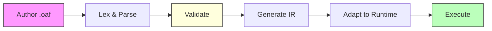
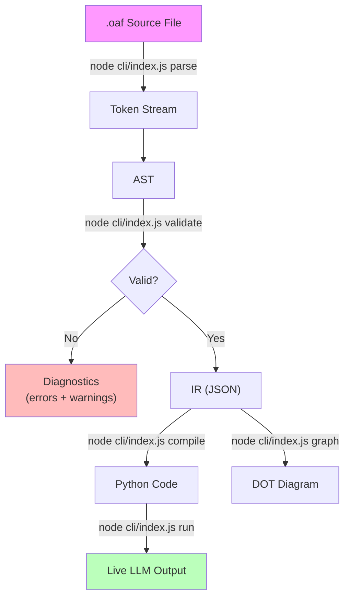

# Workflow Lifecycle

This page traces the complete journey of an OAF workflow — from authoring a `.oaf` file to receiving live LLM output.

---

## Overview



Each stage has a clear input, output, and error surface. Understanding this lifecycle helps you debug issues and know exactly where in the pipeline a problem occurs.

---

## Stage 1: Authoring

You write a `.oaf` file using the OAF language. A workflow defines:

1. **State** — shared variables that agents read and write
2. **Agents** — execution units with instructions, models, and I/O bindings
3. **Flow** — a directed graph connecting agents from `start` to `end`
4. **Config** (optional) — metadata like timeouts and runtime hints

```oaf
workflow "My Workflow" {
    state { ... }
    agent AgentA { ... }
    agent AgentB { ... }
    flow {
        start -> AgentA
        AgentA -> AgentB
        AgentB -> end
    }
}
```

**Error surface:** Syntax errors (typos, missing braces, invalid characters).

---

## Stage 2: Lexical Analysis & Parsing

The **Lexer** reads raw text and produces a token stream. The **Parser** consumes tokens and builds an AST.

### What Happens

1. **Lexer** normalizes line endings (CRLF → LF), strips comments, and produces tokens:
   - Keywords: `workflow`, `agent`, `state`, `flow`, `config`, `start`, `end`
   - Type keywords: `string`, `int`, `float`, `bool`, `list`, `map`
   - Literals: strings, triple-quoted strings, integers, floats, booleans
   - Punctuation: `{ } [ ] ( ) : , -> @`

2. **Parser** uses recursive descent to build an AST with nodes like:
   - `Program` → `WorkflowDecl` → `StateBlock`, `AgentBlock[]`, `FlowBlock`, `ConfigBlock`
   - Each node carries source location (line, column) for diagnostics

### Error Surface

| Error Type | Example |
|---|---|
| `LexerError` | Unexpected character, unterminated string |
| `ParseError` | Missing brace, unexpected token, duplicate property, empty instructions |

### CLI Command

```bash
node cli/index.js parse examples/hello.oaf
```

---

## Stage 3: Semantic Validation

The **Validator** inspects the AST for errors that syntax alone cannot catch. It runs three phases in order:

### Phase 1: Symbol Resolution

- Workflow name is non-empty
- Agent identifiers are unique
- State variable names are unique
- No reserved keywords used as agent names (`start`, `end`, `workflow`, etc.)
- Required blocks are present (at least one agent, exactly one flow)
- State options are validated against the supported options registry

### Phase 2: Reference Validation

- All flow edge references point to declared agents
- All agent `inputs`/`outputs` reference declared state variables
- No duplicate input/output variables within an agent
- Temperature is in range `[0.0, 2.0]`
- Provider is either `"gemini"` or `"openai"`
- Config values are valid (e.g., `max_iterations` is a positive integer)
- Warnings for unused state variables and agents without I/O

### Phase 3: Graph Validation

- Exactly one edge from `start`
- At least one edge to `end`
- All agents reachable from `start` (BFS)
- All agents have a path to `end` (reverse BFS)
- No duplicate edges
- No self-loops
- No cycles (DFS-based cycle detection)

### Error Surface

Diagnostics follow the format: `[SEVERITY] file:line:col — message`

Severity levels:
- **ERROR** — blocks compilation
- **WARNING** — informational, does not block

### CLI Command

```bash
node cli/index.js validate examples/hello.oaf
```

---

## Stage 4: IR Generation

The **IR Generator** transforms the validated AST into a runtime-independent JSON document.

### What Changes from AST to IR

| AST Concept | IR Representation |
|---|---|
| `start -> AgentA` edge | `graph.entrypoint: "AgentA"` |
| `AgentB -> end` edge | `graph.terminals: ["AgentB"]` |
| Agent-to-agent edges | `graph.edges: [{source, target}]` |
| Type expressions (`list[string]`) | Type descriptors (`"list<string>"`) |
| State options (`@required`) | `options: [{name: "required", args: []}]` |

The IR is:
- **Self-contained** — no reference to the source file needed
- **Deterministic** — same input always produces same output
- **JSON-serializable** — can be stored, transmitted, and consumed by any adapter

### CLI Command

```bash
node cli/index.js compile examples/hello.oaf
# Outputs IR JSON to stdout
```

---

## Stage 5: Runtime Adaptation

The **LangGraph Adapter** transforms IR into executable Python code.

### What Gets Generated

A single, self-contained Python script containing:

1. **Imports** — `langgraph`, `langchain_google_genai` / `langchain_openai`, typing
2. **`WorkflowState` TypedDict** — maps state variables to Python types
3. **`get_llm()` helper** — runtime LLM provider selection with auto-detection
4. **Agent node functions** — one function per agent, each:
   - Receives state, builds a prompt from inputs
   - Calls the LLM via `get_llm()`
   - Parses the response and updates state outputs
5. **`build_graph()` function** — constructs the LangGraph `StateGraph`
6. **`__main__` block** — initializes state, handles `--input` files, runs the workflow

### Type Mapping

| OAF Type | Python Type |
|---|---|
| `string` | `str` |
| `int` | `int` |
| `float` | `float` |
| `bool` | `bool` |
| `list[T]` | `List[T]` |
| `map[K, V]` | `Dict[K, V]` |

### CLI Command

```bash
# Generate Python code
node cli/index.js compile examples/hello.oaf --target langgraph -o hello.py

# Or compile and save
node cli/index.js compile examples/hello.oaf -t langgraph -o workflow.py
```

---

## Stage 6: Execution

The **CLI runner** spawns a Python subprocess to execute the generated code.

### What Happens

1. **Pre-flight checks:**
   - Python runtime exists and is accessible
   - At least one API key is configured (`GOOGLE_API_KEY` or `OPENAI_API_KEY`)
   - All agents have a model specified (or `OAF_DEFAULT_MODEL` is set)

2. **Code generation:** Adapter produces Python source

3. **Execution:** Python subprocess runs the script
   - Writes generated code to a temp file
   - Spawns Python with the temp file path
   - Streams stdout/stderr to the terminal
   - Cleans up the temp file on completion

4. **State injection (optional):**
   - `--input data.json` embeds initial state at compile time
   - At runtime, the generated script also reads `--input` or `OAF_INPUT_FILE`

### CLI Command

```bash
node cli/index.js run examples/hello.oaf
node cli/index.js run examples/summarize.oaf --input data.json
```

### Error Surface

| Error | Cause |
|---|---|
| Python not found | Python not installed or not in PATH |
| No API key | Neither `GOOGLE_API_KEY` nor `OPENAI_API_KEY` is set |
| No model specified | Agent has no `model` and `OAF_DEFAULT_MODEL` is unset |
| `ModuleNotFoundError` | Python dependencies not installed (`pip install langgraph ...`) |
| LLM API error | Invalid API key, rate limiting, network issues |

---

## Lifecycle Summary



---

## Next Steps

- **[The `.oaf` Language](../language/oaf-language.md)** — Learn the full syntax
- **[CLI Reference](../cli/cli-reference.md)** — All commands and options
- **[Troubleshooting](../guides/troubleshooting.md)** — Debug common issues
