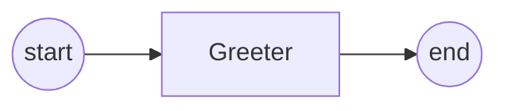
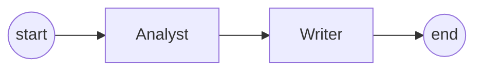
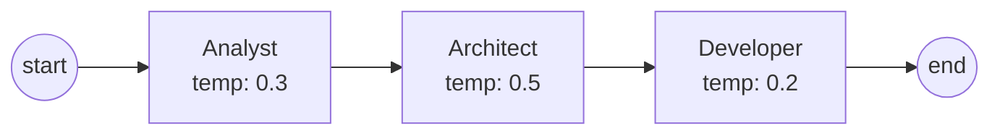

# Examples & Tutorials

This page walks through every built-in OAF example and teaches you to build your own workflows.

---

## Built-In Examples

OAF ships with four example workflows of increasing complexity:

| Example | Agents | Features |
|---|---|---|
| [hello.oaf](#1-hello--minimal-single-agent) | 1 | Simplest possible workflow |
| [summarize.oaf](#2-summarize--two-agent-pipeline) | 2 | Shared state, `@required`, inputs/outputs |
| [software-dev.oaf](#3-software-dev--three-agent-pipeline) | 3 | Tools, config block, temperature tuning |

---

## 1. Hello — Minimal Single Agent

**File:** `examples/hello.oaf`

The simplest possible OAF workflow: one agent, no state.

```oaf
// Minimal workflow: single agent, no state
workflow "Hello" {

    agent Greeter {
        instructions: "Say hello to the user."
        model: "gemini-2.0-flash"
    }

    flow {
        start -> Greeter
        Greeter -> end
    }

}
```

### Topology



### What This Demonstrates

- Minimal workflow structure: workflow name, one agent, one flow
- Agent with `instructions` and `model` — no state needed
- The simplest `start -> Agent -> end` flow

### Run It

```bash
oaf run examples/hello.oaf
```

---

## 2. Summarize — Two-Agent Pipeline

**File:** `examples/summarize.oaf`

A two-agent pipeline that analyzes text and produces a summary, demonstrating shared state and the `@required` option.

```oaf
// Summarize workflow: analyze text then produce a summary
workflow "Summarize" {

    state {
        request: string
        source_text: string @required
        key_points: list[string]
        summary: string
    }

    agent Analyst {
        instructions: """
        Analyze the request and source text.
        Identify the most important facts, themes, and action items.
        Produce concise key_points only.
        """
        inputs: [request, source_text]
        outputs: [key_points]
        model: "gemini-2.0-flash"
    }

    agent Writer {
        instructions: """
        Use the key_points to write a clear, concise summary.
        Preserve meaning, remove redundancy, and match the requested tone.
        """
        inputs: [key_points]
        outputs: [summary]
        model: "gemini-2.0-flash"
    }

    flow {
        start -> Analyst
        Analyst -> Writer
        Writer -> end
    }

    config {
        version: "0.1"
        runtime: "langgraph"
    }

}
```

### Topology



### What This Demonstrates

- **State block** with typed variables (`string`, `list[string]`)
- **`@required`** option on `source_text` — must be provided via `--input`
- **Inputs/outputs** — agents read from and write to shared state
- **Triple-quoted strings** for multi-line instructions
- **Config block** with version and runtime hints
- **Data flow:** Analyst reads `request` + `source_text`, produces `key_points` → Writer reads `key_points`, produces `summary`

### Run It

```bash
# With input data
oaf run examples/summarize.oaf --input examples/summarize-input.json
```

### Input File (`summarize-input.json`)

The `summarize-input.json` file provides the required `source_text`:

```json
{
    "source_text": "Your text to summarize...",
    "request": "Summarize the key technical findings"
}
```

---

## 3. Software Dev — Three-Agent Pipeline

**File:** `examples/software-dev.oaf`

A three-agent pipeline simulating a software development process with tools and configuration.

```oaf
// Three-agent pipeline: research → design → implement
workflow "Software Development" {

    state {
        requirements: string
        analysis: string
        architecture: string
        implementation: string
        status: string
    }

    agent Analyst {
        instructions: """
        Analyze the requirements document.
        Identify key features, constraints, and acceptance criteria.
        Produce a structured analysis.
        """
        model: "gemini-2.0-flash"
        temperature: 0.3
        inputs: [requirements]
        outputs: [analysis]
    }

    agent Architect {
        instructions: """
        Based on the analysis, design a technical architecture.
        Include component diagrams, data flow, and API contracts.
        """
        model: "gemini-2.0-flash"
        temperature: 0.5
        inputs: [analysis]
        outputs: [architecture]
    }

    agent Developer {
        instructions: """
        Implement the solution based on the architecture.
        Write clean, tested, production-ready code.
        """
        model: "gemini-2.0-flash"
        temperature: 0.2
        tools: ["code_interpreter", "file_writer"]
        inputs: [architecture]
        outputs: [implementation, status]
    }

    flow {
        start -> Analyst
        Analyst -> Architect
        Architect -> Developer
        Developer -> end
    }

    config {
        version: "0.1"
        timeout_seconds: 600
    }

}
```

### Topology



### What This Demonstrates

- **Three-agent linear pipeline** with sequential data flow
- **Temperature tuning** — lower for analysis (0.3), higher for design (0.5), lowest for code (0.2)
- **Tools property** — Developer agent declares external tools
- **Multiple outputs** — Developer writes to both `implementation` and `status`
- **Config with timeout** — 600 second timeout

---

## Building Your Own Workflow

### Step-by-Step Guide

#### 1. Define the Problem

What task should the workflow accomplish? Break it into distinct steps that could each be handled by a specialized agent.

#### 2. Design the State

What data flows between agents? Define variables for each piece of information:

```oaf
state {
    // Inputs — what starts the workflow
    user_query: string @required

    // Intermediate — data passed between agents
    research_results: list[string]
    analysis: string

    // Outputs — what the workflow produces
    final_report: string
}
```

#### 3. Define Agents

Create one agent per distinct task. Write clear, specific instructions:

```oaf
agent Researcher {
    instructions: """
    Search for relevant information about the user's query.
    Return 3-5 key findings as a structured list.
    """
    model: "gemini-2.0-flash"
    temperature: 0.3
    inputs: [user_query]
    outputs: [research_results]
}

agent Analyst {
    instructions: """
    Analyze the research results.
    Identify patterns, contradictions, and key insights.
    Produce a structured analysis.
    """
    model: "gemini-2.0-flash"
    temperature: 0.4
    inputs: [research_results]
    outputs: [analysis]
}

agent ReportWriter {
    instructions: """
    Write a comprehensive report combining the analysis
    and original query context.
    Target: 500-800 words, professional tone.
    """
    model: "gemini-2.0-flash"
    temperature: 0.7
    inputs: [user_query, analysis]
    outputs: [final_report]
}
```

#### 4. Connect the Flow

```oaf
flow {
    start -> Researcher
    Researcher -> Analyst
    Analyst -> ReportWriter
    ReportWriter -> end
}
```

#### 5. Validate Before Running

Always validate first to catch errors cheaply:

```bash
oaf validate my-workflow.oaf
```

#### 6. Test with Input Data

Create a JSON file with test data:

```json
{
    "user_query": "What are the latest trends in renewable energy?"
}
```

```bash
oaf run my-workflow.oaf --input test-data.json
```

---

## Common Patterns

### Linear Pipeline

The most common pattern — agents process data sequentially:

```oaf
flow {
    start -> A
    A -> B
    B -> C
    C -> end
}
```

### Fan-Out

One agent's output feeds multiple downstream agents:

```oaf
flow {
    start -> Router
    Router -> PathA
    Router -> PathB
    PathA -> end
    PathB -> end
}
```

### Diamond

Multiple paths converge on a single agent:

```oaf
flow {
    start -> Splitter
    Splitter -> AnalystA
    Splitter -> AnalystB
    AnalystA -> Merger
    AnalystB -> Merger
    Merger -> end
}
```

> **Note:** In v0.1, all paths execute sequentially (LangGraph processes nodes in topological order). True parallel execution is planned for future versions.

---

## Next Steps

- **[The `.oaf` Language](../language/oaf-language.md)** — Full syntax reference
- **[Best Practices](../guides/best-practices.md)** — Design patterns and tips
- **[CLI Reference](../cli/cli-reference.md)** — All commands
