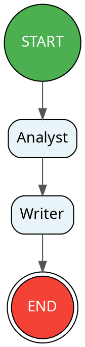

# Quick Start

Build and run your first OAF workflow in 5 minutes.

> **Prerequisites:** Make sure you've completed the [Installation](installation.md) guide first.

---

## Your First Workflow

### Step 1: Create a `.oaf` File

Create a file called `my-first.oaf`:

```oaf
// my-first.oaf — A minimal single-agent workflow
workflow "My First Workflow" {

    agent Greeter {
        instructions: "Say hello to the user in a friendly, enthusiastic way."
        model: "gemini-2.0-flash"
    }

    flow {
        start -> Greeter
        Greeter -> end
    }

}
```

This defines:
- A **workflow** named "My First Workflow"
- A single **agent** called `Greeter` with instructions and a model
- A **flow** graph: `start → Greeter → end`

### Step 2: Parse It

Verify the syntax by parsing the file into an AST:

```bash
node cli/index.js parse my-first.oaf
```

You'll see JSON output representing the Abstract Syntax Tree — this confirms the syntax is valid.

### Step 3: Validate It

Run semantic validation to check for structural issues:

```bash
node cli/index.js validate my-first.oaf
```

Expected output:
```
✓ my-first.oaf is valid.
```

### Step 4: Compile to IR

Generate the Intermediate Representation (a runtime-independent JSON format):

```bash
node cli/index.js compile my-first.oaf
```

This outputs the IR JSON, which captures the fully validated meaning of your workflow.

### Step 5: Run It Live

Execute the workflow against a real LLM:

```bash
node cli/index.js run my-first.oaf
```

The CLI will:
1. Compile the `.oaf` to a Python LangGraph script
2. Execute it via a Python subprocess
3. Stream the output to your terminal

You'll see the Greeter agent respond with a friendly hello message!

---

## Adding Shared State

Let's build a more useful two-agent workflow with shared state:

```oaf
// summarizer.oaf — Two agents sharing state
workflow "Article Summarizer" {

    state {
        article: string
        key_points: list[string]
        summary: string
    }

    agent Analyst {
        instructions: """
        Read the article text and extract the 3-5 most important points.
        Return them as a concise bulleted list.
        """
        model: "gemini-2.0-flash"
        temperature: 0.2
        inputs: [article]
        outputs: [key_points]
    }

    agent Writer {
        instructions: """
        Write a clear, 2-3 sentence summary based on the key points.
        Keep it concise and professional.
        """
        model: "gemini-2.0-flash"
        temperature: 0.7
        inputs: [key_points]
        outputs: [summary]
    }

    flow {
        start -> Analyst
        Analyst -> Writer
        Writer -> end
    }

}
```

**What's new here:**

| Concept | What It Does |
|---|---|
| `state { ... }` | Declares shared variables that agents read from and write to |
| `inputs: [article]` | The Analyst reads the `article` variable from state |
| `outputs: [key_points]` | The Analyst writes `key_points` back to state |
| `temperature: 0.2` | Low temperature = more deterministic, focused output |

Run it:

```bash
node cli/index.js run summarizer.oaf
```

---

## Injecting Initial Data

Provide initial state values via a JSON file using `--input`:

### Create an Input File

Create `article-data.json`:

```json
{
  "article": "Artificial intelligence is transforming healthcare. Recent studies show AI diagnostics matching expert physicians in accuracy for certain conditions. However, concerns about data privacy and algorithmic bias remain significant barriers to adoption."
}
```

### Run With Input

```bash
node cli/index.js run summarizer.oaf --input article-data.json
```

The `article` state variable is now pre-populated with your text, and the agents will process it through the pipeline.

---

## Visualizing the Workflow Graph

Generate a Graphviz DOT diagram of any workflow:

```bash
node cli/index.js graph summarizer.oaf
```

Output:


Paste this into any Graphviz renderer (like [Graphviz Online](https://dreampuf.github.io/GraphvizOnline/)) to see a visual diagram.

---

## Compiling to Python

Save the generated LangGraph Python code to a file:

```bash
node cli/index.js compile summarizer.oaf --target langgraph -o summarizer.py
```

This produces a self-contained Python script that you can run independently:

```bash
python summarizer.py --input article-data.json
```

---

## The Pipeline at a Glance

Every OAF command follows this pipeline:

```
┌─────────────┐     ┌───────────┐     ┌──────────┐     ┌───────────┐
│  .oaf File  │ ──▶ │   Lexer   │ ──▶ │  Parser  │ ──▶ │    AST    │
└─────────────┘     └───────────┘     └──────────┘     └─────┬─────┘
                                                              │
┌─────────────┐     ┌───────────┐     ┌──────────┐     ┌─────▼─────┐
│  Execution  │ ◀── │  Adapter  │ ◀── │    IR    │ ◀── │ Validator │
└─────────────┘     └───────────┘     └──────────┘     └───────────┘
```

| Command | Stops At |
|---|---|
| `parse` | AST |
| `validate` | Validator |
| `compile` | IR (default) or Adapter (with `--target langgraph`) |
| `run` | Execution |
| `graph` | IR → DOT output |

---

## Next Steps

- **[The `.oaf` Language](../language/oaf-language.md)** — Learn every syntax feature
- **[Examples](../examples/examples.md)** — Walk through all built-in examples
- **[CLI Reference](../cli/cli-reference.md)** — All commands and flags
- **[Architecture](../core-concepts/architecture.md)** — Understand how OAF works internally
