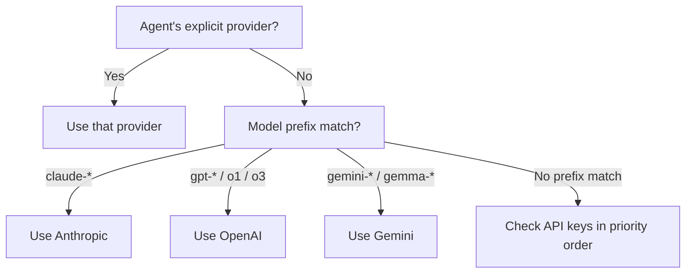
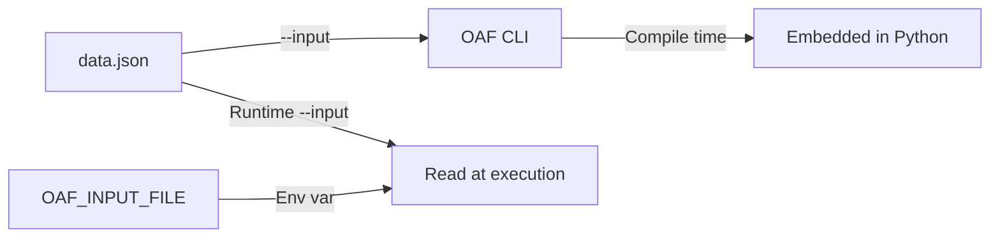

# Configuration Guide

This guide covers all configuration options in OpenAgentFlow — environment variables, config blocks, LLM providers, and state injection.

---

## Environment Variables

| Variable | Required | Description |
|---|---|---|
| `GOOGLE_API_KEY` | At least one of Gemini/OpenAI/Anthropic | Google Gemini API key |
| `OPENAI_API_KEY` | At least one of Gemini/OpenAI/Anthropic | OpenAI API key |
| `ANTHROPIC_API_KEY` | At least one of Gemini/OpenAI/Anthropic | Anthropic API key |
| `OAF_DEFAULT_MODEL` | No | Default model when agent has no `model` property |
| `OAF_INPUT_FILE` | No | Runtime path to a JSON file for initial state injection |
| `VIRTUAL_ENV` | No | Python virtual environment path (auto-detected) |

### Environment Variable Hierarchy

OpenAgentFlow resolves environment variables using a 4-tier resolution hierarchy (highest to lowest priority):

1. **Inline CLI overrides:** `OPENAI_API_KEY=sk-... oaf run summarize.oaf`
2. **Local Project `.env`:** An `.env` file located in the same directory as the `.oaf` file being executed or compiled.
3. **System Environment Variables:** Standard system environment variables set in the shell (`export KEY=val` or `$env:KEY = "val"`).
4. **Global OAF Store (`~/.oaf/.env`):** Global user configuration baseline.

When compiling or running a workflow, `oaf` automatically loads local and global `.env` files into the runtime environment without overwriting variables that are already set by higher-priority tiers.

### `oaf auth` Command

You can easily set up your API keys using the interactive `oaf auth` command:

```bash
oaf auth
```

This interactive utility prompts you for your API keys (`OPENAI_API_KEY`, `ANTHROPIC_API_KEY`, `GOOGLE_API_KEY`) and stores them securely in the global configuration file at `~/.oaf/.env`. When creating `~/.oaf/.env`, OpenAgentFlow automatically sets the file permissions to `0o600` (`-rw-------`), ensuring that your API keys are readable and writable only by the file owner.

### Setting Environment Variables Manually

**Windows PowerShell:**
```powershell
$env:OPENAI_API_KEY = "sk-..."
$env:ANTHROPIC_API_KEY = "sk-ant-..."
$env:GOOGLE_API_KEY = "AIza..."
$env:OAF_DEFAULT_MODEL = "claude-3-5-sonnet-20241022"
```

**macOS / Linux:**
```bash
export OPENAI_API_KEY="sk-..."
export ANTHROPIC_API_KEY="sk-ant-..."
export GOOGLE_API_KEY="AIza..."
export OAF_DEFAULT_MODEL="claude-3-5-sonnet-20241022"
```

---

## LLM Provider Configuration

### Multi-Provider System

OAF supports three leading LLM providers: **Gemini**, **OpenAI**, and **Anthropic**. The compiler and generated Python runtime auto-detect which provider to use based on model names and available API keys.



### Provider Priority & Inference

1. **Per-agent `provider` property** — if explicitly set (`provider: "anthropic"`, `"gemini"`, or `"openai"`), takes absolute priority.
2. **Automatic Model Prefix Inference** — if `provider` is omitted, OAF infers the provider from the `model` string prefix:
   - `claude-*` → `"anthropic"`
   - `gpt-*`, `o1`, `o3` → `"openai"`
   - `gemini-*`, `gemma-*` → `"gemini"`
3. **Environment Key Fallback** — if neither `provider` nor a recognized model prefix is present, the runtime checks API keys in priority order (`GOOGLE_API_KEY` → `OPENAI_API_KEY` → `ANTHROPIC_API_KEY`).

### Per-Agent Provider Override

You can mix providers across agents in a single workflow:

```oaf
agent FastAnalyst {
    instructions: "Quick analysis."
    model: "gemini-2.0-flash"
    provider: "gemini"          // Explicit Gemini
    inputs: [data]
    outputs: [analysis]
}

agent QualityWriter {
    instructions: "High-quality writing."
    model: "claude-3-5-sonnet-20241022"
    provider: "anthropic"       // Explicit Anthropic
    inputs: [analysis]
    outputs: [content]
}
```

### Model Configuration

Models are used **directly without mapping**. Whatever you write in `model:` is passed to the LLM provider as-is:

```oaf
agent A { model: "gemini-2.0-flash" }           // → ChatGoogleGenerativeAI(model="gemini-2.0-flash")
agent B { model: "gpt-4o" }                     // → ChatOpenAI(model="gpt-4o")
agent C { model: "claude-3-5-sonnet-20241022" } // → ChatAnthropic(model="claude-3-5-sonnet-20241022")
```

### Default Model

If an agent doesn't specify a `model`, the runtime checks `OAF_DEFAULT_MODEL`:

```bash
export OAF_DEFAULT_MODEL="claude-3-5-sonnet-20241022"
```

If neither is set, the `run` command fails with a clear error:
```
Error: No model specified for agent "AgentName" and no default model configured.
```

---

## Config Block

The optional `config` block in `.oaf` files provides workflow-level metadata:

```oaf
config {
    version: "0.1"
    runtime: "langgraph"
    max_iterations: 10
    timeout_seconds: 300
}
```

### Validated Keys

| Key | Type | Validation | Description |
|---|---|---|---|
| `max_iterations` | Positive integer | Must be > 0 | Maximum workflow iterations |
| `timeout_seconds` | Positive number | Must be > 0 | Workflow timeout in seconds |
| `runtime` | String | Must be `"langgraph"` | Target runtime |

Other keys are passed through to the IR without validation. This allows forward-compatible metadata.

### Config Values

Config values can be:
- **Strings:** `version: "0.1"`
- **Integers:** `max_iterations: 10`
- **Floats:** `timeout_seconds: 300.5`
- **Booleans:** `debug: true`

---

## State Injection (`--input`)

You can inject initial state values into a workflow at compile time or runtime.

### How It Works



### Compile-Time Injection

Pass `--input` during `compile` or `run`:

```bash
node cli/index.js compile file.oaf -t langgraph -i data.json -o output.py
node cli/index.js run file.oaf --input data.json
```

The JSON values are embedded directly in the generated Python code as initial state.

### Runtime Injection

The generated Python script also supports runtime injection:

```bash
# Via --input flag
python output.py --input data.json

# Via environment variable
OAF_INPUT_FILE=data.json python output.py
```

Runtime values **override** compile-time values via `initial_state.update(runtime_input)`.

### Input File Format

The input file must be a JSON object (not an array):

```json
{
    "feedback": "The product is great but the UI needs improvement.",
    "priority": 3,
    "tags": ["ui", "feedback"],
    "metadata": {
        "source": "support_ticket",
        "id": "T-1234"
    }
}
```

### Input Validation

The adapter validates input data at compile time:

| Check | Error |
|---|---|
| Unknown keys | `Input JSON contains variable "X" which is not defined in workflow state` |
| Type mismatch | `Type mismatch for state variable "X": expected string, found number` |
| Missing required | `Missing required initial state variable: "X"` |

### Required Fields

State variables with `@required` must be provided via `--input`:

```oaf
state {
    feedback: string @required
    sentiment: string
}
```

```json
{
    "feedback": "Great product!"
}
```

If `feedback` is missing from the input, compilation fails with:
```
Missing required initial state variable: "feedback"
```

---

## Console Encoding

The generated Python code includes encoding safety:

```python
if hasattr(sys.stdout, 'reconfigure'):
    sys.stdout.reconfigure(encoding='utf-8')
```

This prevents crashes on Windows terminals with non-UTF-8 codepages (e.g., `cp1256`, `cp1252`). The fix:
- Reconfigures stdout to UTF-8
- Uses ASCII separators (`-` instead of `─`) for terminal output

---

## Python Runtime Detection

The CLI auto-detects the Python executable in this order:

| Priority | Path | Condition |
|---|---|---|
| 1 | `$VIRTUAL_ENV/Scripts/python.exe` | `VIRTUAL_ENV` env var is set (Windows) |
| 2 | `$VIRTUAL_ENV/bin/python` | `VIRTUAL_ENV` env var is set (POSIX) |
| 3 | `.venv/Scripts/python.exe` | Local `.venv` directory exists (Windows) |
| 4 | `.venv/bin/python` | Local `.venv` directory exists (POSIX) |
| 5 | `python` | System PATH |

---

## Configuration Checklist

For a fully working OAF setup:

- [ ] Node.js v18+ installed
- [ ] Python 3.10+ installed (for `run` command)
- [ ] Python packages installed: `langgraph`, `langchain-google-genai`, `langchain-openai`, `pydantic`
- [ ] At least one API key set: `GOOGLE_API_KEY` or `OPENAI_API_KEY`
- [ ] All agents have `model:` property or `OAF_DEFAULT_MODEL` is set
- [ ] Input data (if using `--input`) matches workflow state schema

---

## Next Steps

- **[CLI Reference](../cli/cli-reference.md)** — All commands and flags
- **[Best Practices](best-practices.md)** — Design patterns and tips
- **[Troubleshooting](troubleshooting.md)** — Debug common issues
