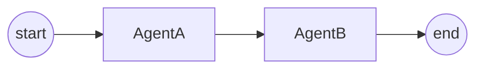

# The `.oaf` Language

This is the complete reference for the OpenAgentFlow domain-specific language. Every syntax feature, block type, type system construct, and validation rule is documented here.

---

## File Format

- **Extension:** `.oaf`
- **Encoding:** UTF-8
- **Line endings:** LF or CRLF (normalized to LF during lexing)
- **Comments:** Line comments starting with `//`
- **Semicolons:** Not required — whitespace and newlines separate statements
- **Trailing commas:** Allowed in lists: `[a, b, c,]`

```oaf
// This is a comment
workflow "My Workflow" {
    // Everything lives inside a single workflow block
}
```

---

## Top-Level Structure

Every `.oaf` file contains exactly **one** `workflow` declaration:

```oaf
workflow "<name>" {
    state { ... }       // Optional (at most one)
    config { ... }      // Optional (at most one)
    agent <Id> { ... }  // Required (one or more)
    flow { ... }        // Required (exactly one)
}
```

Blocks can appear in any order within the workflow.

### Rules

| Rule | Constraint |
|---|---|
| Workflow name | Non-empty quoted string |
| `state` block | At most one |
| `config` block | At most one |
| `agent` blocks | At least one |
| `flow` block | Exactly one |

---

## Identifiers

### Workflow Name

A quoted string literal:

```oaf
workflow "Customer Feedback Analysis" { ... }
```

### Agent Identifiers

Unquoted identifiers matching `[A-Za-z_][A-Za-z0-9_-]*`:

```oaf
agent SentimentAnalyzer { ... }
agent my_agent { ... }
```

> **Note:** Identifiers may contain hyphens (`-`) as long as they don't form the arrow operator (`->`).

### Reserved Identifiers

The following cannot be used as agent names:

| Reserved | Purpose |
|---|---|
| `start` | Flow graph entry point |
| `end` | Flow graph termination point |
| `workflow` | Keyword |
| `agent` | Keyword |
| `state` | Keyword |
| `flow` | Keyword |
| `config` | Keyword |

---

## State Block

The `state` block defines shared variables accessible to all agents during execution.

```oaf
state {
    <name>: <type> [@option [(args)]]
    ...
}
```

### Example

```oaf
state {
    request: string @required @description("User's initial request")
    source_text: string @required
    key_points: list[string]
    summary: string
    score: float @default(0.0)
    metadata: map[string, string]
    tags: list[string] @reducer("append")
    count: int @min(0) @max(100)
}
```

---

### Type System

OAF supports six types:

| Type | Description | Example |
|---|---|---|
| `string` | Text value | `name: string` |
| `int` | Integer number | `count: int` |
| `float` | Floating-point number | `score: float` |
| `bool` | Boolean value | `done: bool` |
| `list[T]` | Ordered collection of type `T` | `items: list[string]` |
| `map[K, V]` | Key-value mapping | `data: map[string, int]` |

Generic types can be nested:

```oaf
state {
    matrix: list[list[int]]
    nested_map: map[string, list[string]]
}
```

---

### State Options

State variables support optional decorators prefixed with `@`. These are placed after the type:

```oaf
state {
    request: string @required @description("Initial request")
}
```

#### Supported Options Registry

| Option | Arguments | Description |
|---|---|---|
| `@required` | 0 | Marks the variable as required before workflow execution begins |
| `@default(value)` | Exactly 1 | Provides a default initial value if not provided |
| `@description("text")` | Exactly 1 | Human-readable description for introspection or prompting |
| `@desc("text")` | Exactly 1 | Shorthand for `@description` |
| `@reducer("strategy")` | Exactly 1 | Merge strategy for concurrent updates (e.g., `"append"`, `"replace"`) |
| `@min(num)` | Exactly 1 | Minimum numeric value allowed for `int` or `float` variables |
| `@max(num)` | Exactly 1 | Maximum numeric value allowed for `int` or `float` variables |

#### Option Arguments

Arguments are enclosed in parentheses and can be:
- Strings: `@description("User input")`
- Numbers: `@min(0)`, `@max(100)`, `@default(0.5)`
- Identifiers: `@reducer(append)`

Multiple arguments are comma-separated. Trailing commas are allowed.

#### Option Rules

- Each option must be unique on a given state variable (no duplicate `@required`)
- Unsupported option names produce a compile-time error
- Argument counts are validated against the registry (e.g., `@required` takes 0 args)

---

## Agent Block

An `agent` block declares an execution unit — an LLM-powered step in the workflow.

```oaf
agent <Identifier> {
    instructions: <string>       // Required
    model: <string>              // Optional
    provider: <string>           // Optional
    temperature: <float>         // Optional
    tools: [<string>, ...]       // Optional
    inputs: [<identifier>, ...]  // Optional
    outputs: [<identifier>, ...] // Optional
}
```

### Properties

| Property | Required | Type | Description |
|---|---|---|---|
| `instructions` | **Yes** | String | Prompt text for the agent. Cannot be empty. |
| `model` | No | String | LLM model identifier (e.g., `"gemini-2.0-flash"`, `"gpt-4"`). Used directly — no mapping. |
| `provider` | No | String | LLM provider: `"gemini"` or `"openai"`. Overrides auto-detection. |
| `temperature` | No | Float | Sampling temperature. Must be in range `[0.0, 2.0]`. |
| `tools` | No | String list | External tool names the agent can invoke. |
| `inputs` | No | Identifier list | State variables this agent reads. Must reference declared state variables. |
| `outputs` | No | Identifier list | State variables this agent writes. Must reference declared state variables. |

### Agent Rules

- `instructions` is the only required property
- Instructions cannot be an empty string
- Each property can appear at most once (no duplicate `model:` etc.)
- `inputs` and `outputs` reference state variable names, not quoted strings
- Duplicate entries within `inputs` or `outputs` are errors
- If no `model` is set, the runtime requires `OAF_DEFAULT_MODEL` environment variable

### Multi-Line Instructions

Use triple-quoted strings for multi-line content. Leading whitespace is automatically stripped (Python-style dedent):

```oaf
agent Writer {
    instructions: """
    Write a clear, concise summary based on the key points.
    Keep the tone professional.
    Target length: 2-3 paragraphs.
    """
    model: "gemini-2.0-flash"
    temperature: 0.7
    inputs: [key_points]
    outputs: [summary]
}
```

### Provider Override

By default, the runtime auto-detects the provider from API keys. You can override per agent:

```oaf
agent AnalystGemini {
    instructions: "Analyze data using Gemini."
    model: "gemini-2.0-flash"
    provider: "gemini"
    inputs: [data]
    outputs: [analysis]
}

agent WriterOpenAI {
    instructions: "Write content using GPT-4."
    model: "gpt-4"
    provider: "openai"
    inputs: [analysis]
    outputs: [content]
}
```

### Temperature Guide

| Temperature | Behavior | Use Case |
|---|---|---|
| `0.0 – 0.3` | Deterministic, focused | Classification, extraction, analysis |
| `0.4 – 0.7` | Balanced | General-purpose tasks |
| `0.8 – 1.2` | Creative, varied | Writing, brainstorming |
| `1.3 – 2.0` | Highly random | Experimental use |

---

## Flow Block

The `flow` block defines the execution graph as directed edges between agents.

```oaf
flow {
    start -> AgentA
    AgentA -> AgentB
    AgentB -> end
}
```

### Edge Syntax

```
<source> -> <destination>
```

Where `<source>` and `<destination>` are:
- An agent identifier
- `start` (source only)
- `end` (destination only)

### Flow Topology



### Fan-Out Example

One agent can have multiple successors:

```oaf
flow {
    start -> Router
    Router -> Analyst
    Router -> Writer
    Analyst -> end
    Writer -> end
}
```

### Flow Rules

| Rule | Description |
|---|---|
| **Exactly one start edge** | There must be exactly one edge with `start` as the source |
| **At least one end edge** | At least one edge must target `end` |
| **Reachability** | All declared agents must be reachable from `start` |
| **Termination** | All declared agents must have a path to `end` |
| **No duplicate edges** | No two edges may have the same source and target |
| **No self-loops** | An edge cannot connect a node to itself |
| **Acyclicity (v0.1)** | The graph must be a DAG — no cycles |
| **No outgoing from `end`** | `end` cannot be a source |
| **No incoming to `start`** | `start` cannot be a target |

### Flow Validation Errors

| Error Message | Cause |
|---|---|
| `Missing start edge` | No edge originates from `start` |
| `Multiple start edges` | More than one edge from `start` |
| `No edge leads to end` | No edge targets `end` |
| `Undefined agent in flow: "X"` | Edge references an undeclared agent |
| `Unreachable agent: "X"` | Agent cannot be reached from `start` |
| `Agent has no path to end: "X"` | Agent has no path to `end` |
| `Duplicate edge: A -> B` | Same edge declared twice |
| `Self-loop detected: A -> A` | Edge connects agent to itself |
| `Cycle detected in flow graph involving: A, B` | Circular dependency |
| `Outgoing edge from end node not allowed` | `end` used as a source |
| `Incoming edge to start node not allowed` | `start` used as a target |

---

## Config Block

The optional `config` block provides workflow-level metadata and runtime hints.

```oaf
config {
    <key>: <value>
    ...
}
```

### Example

```oaf
config {
    version: "0.1"
    runtime: "langgraph"
    max_iterations: 10
    timeout_seconds: 300
}
```

### Config Values

Values can be strings, integers, floats, or booleans:

```oaf
config {
    version: "0.1"          // string
    max_iterations: 10      // integer
    timeout_seconds: 300.5  // float
    debug: true             // boolean
}
```

### Validated Config Keys

| Key | Type | Validation |
|---|---|---|
| `max_iterations` | Positive integer | Must be > 0 |
| `timeout_seconds` | Positive number | Must be > 0 |
| `runtime` | String | Must be `"langgraph"` (currently the only supported runtime) |

Other keys are allowed but not validated — they pass through to the IR as-is.

### Config Rules

- At most one `config` block per workflow
- Each key must be unique (no duplicate keys)
- Validated keys are type-checked at compile time

---

## String Literals

### Single-Quoted Strings

```oaf
model: "gpt-4"
instructions: "Say hello."
```

#### Escape Sequences

| Escape | Character |
|---|---|
| `\"` | Double quote |
| `\\` | Backslash |
| `\n` | Newline |
| `\t` | Tab |

### Triple-Quoted Strings

For multi-line content. Leading whitespace is automatically stripped using a common-indent algorithm (similar to Python's `textwrap.dedent`):

```oaf
instructions: """
    Line one.
    Line two.
    Line three.
"""
// Result: "Line one.\nLine two.\nLine three."
```

The dedent algorithm:
1. Removes leading and trailing blank lines
2. Finds the minimum indent across non-blank lines
3. Strips that indent from all lines

---

## Comments

Line comments begin with `//` and continue to the end of the line:

```oaf
// This is a full-line comment
workflow "Test" {  // This is an inline comment
    agent A {
        instructions: "Do something"  // Comment after property
    }
}
```

Comments are stripped during lexical analysis and do not appear in the AST.

---

## Complete Example

Here's a complete workflow using most language features:

```oaf
// Customer feedback analysis pipeline
workflow "Customer Feedback Analysis" {

    state {
        feedback: string @required @description("Raw customer feedback text")
        sentiment: string
        category: string
        key_issues: list[string]
        response_draft: string
    }

    agent SentimentAnalyzer {
        instructions: """
        Analyze the customer feedback for sentiment.
        Classify as: positive, negative, neutral, or mixed.
        Return only the classification as a single word.
        """
        model: "gpt-4"
        temperature: 0.1
        inputs: [feedback]
        outputs: [sentiment]
    }

    agent Categorizer {
        instructions: """
        Based on the feedback and sentiment, categorize as:
        bug_report, feature_request, praise, complaint, or question.
        Also extract the top 3 key issues.
        Return JSON with "category" and "key_issues" fields.
        """
        model: "gpt-4"
        temperature: 0.2
        inputs: [feedback, sentiment]
        outputs: [category, key_issues]
    }

    agent ResponseDrafter {
        instructions: """
        Draft a professional response addressing:
        - The original feedback
        - The detected sentiment
        - The category
        - The key issues
        Keep it under 200 words.
        """
        model: "gpt-4"
        temperature: 0.7
        inputs: [feedback, sentiment, category, key_issues]
        outputs: [response_draft]
    }

    flow {
        start -> SentimentAnalyzer
        SentimentAnalyzer -> Categorizer
        Categorizer -> ResponseDrafter
        ResponseDrafter -> end
    }

    config {
        version: "0.1"
        runtime: "langgraph"
    }

}
```

---

## Next Steps

- **[Examples](../examples/examples.md)** — Walk through all built-in examples
- **[CLI Reference](../cli/cli-reference.md)** — Run workflows from the command line
- **[API Reference](../api/api-reference.md)** — Use the compiler programmatically
